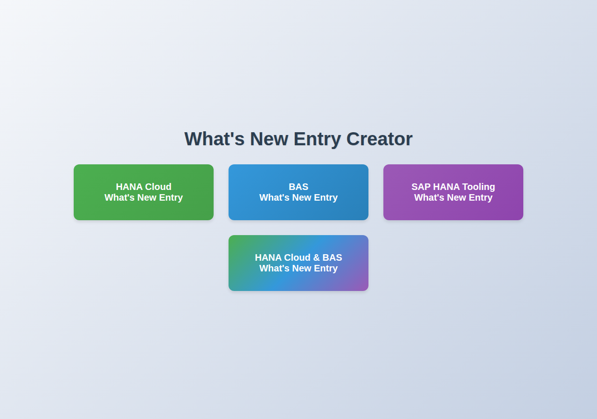
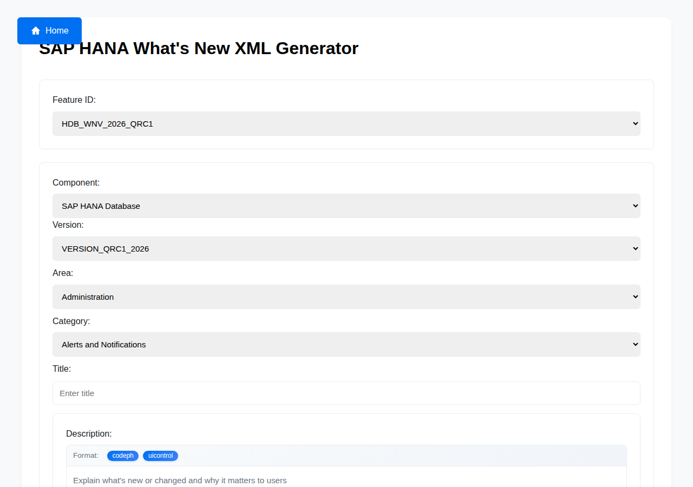
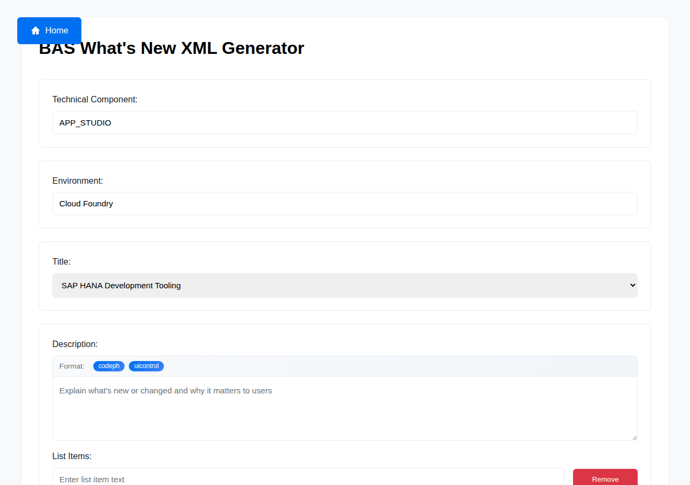
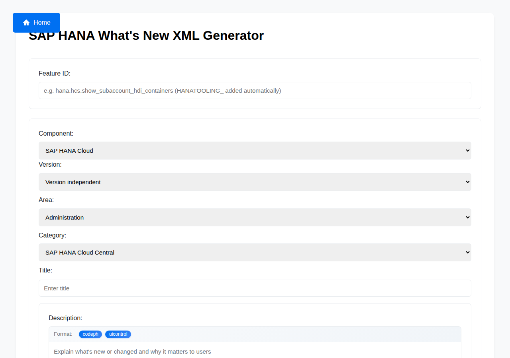
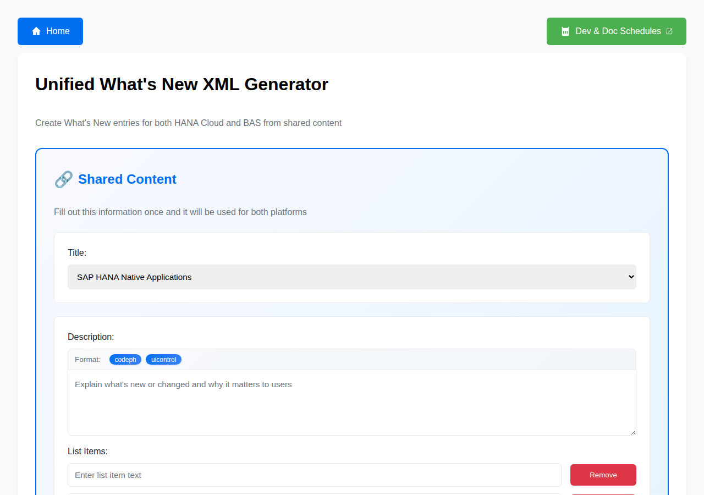

# WING
What's New Viewer XML Generator

## Overview

**WING** (What's New Viewer XML Generator) is a suite of browser-based tools for SAP documentation teams. It generates correctly structured XML `<row>` elements for What's New viewer topics, ready to paste directly into IXIASOFT CCMS — no installation required.

### Key Features

- Runs entirely in the browser as standalone HTML files
- Supports four documentation areas: HANA Cloud, BAS, SAP HANA Tooling, and a unified HANA Cloud + BAS entry
- Validates required fields and formats XML output automatically
- One-click copy to clipboard

### Tools at a Glance

| Tool | File | Description |
|---|---|---|
| Landing Page | `index.html` | Entry point with links to all generators |
| HANA Cloud Generator | `HDB_WNV.html` | XML for SAP HANA Cloud What's New entries |
| BAS Generator | `BAS_WNV.html` | XML for SAP Business Application Studio entries |
| Tooling Generator | `TOOLING_WNV.html` | XML for SAP HANA Tooling entries (optional feature toggle) |
| Unified Generator | `UNIFIED_WNV.html` | Combined HANA Cloud + BAS entry in one operation |

### Screenshots

**Landing Page**


**HANA Cloud Generator**


**BAS Generator**


**SAP HANA Tooling Generator**


**Unified Generator (HANA Cloud + BAS)**


---

## How to Add a What's New Entry

### Step 1: Open the XML What's New Generator

Navigate to the main page of the XML What's New Generator.

### Step 2: Select Your Entry Type

Choose the type that matches your What's New entry:

- **HANA**
- **Tooling**
- **BAS**
- **Combined BAS + HANA**

### Step 3: Fill In the Entry Details

Provide the following information:

| Field | Description |
|---|---|
| **Title** | The title of your What's New entry |
| **Text** | A short description of the new feature or change |
| **Link** | The URL to the related topic |
| **Topic title** | The title of the linked topic |

### Step 4: Add a Feature Toggle *(Tooling only)*

If your entry is of type **Tooling**, you can optionally specify a feature toggle.

For example: `HANATOOLING_hana.cockpit.hdb.admin.hdi_3`

> For all other entry types, skip this step.

### Step 5: Enter Your JIRA Key

Enter the JIRA ticket key associated with this change (e.g., `HANA-12345`).

### Step 6: Generate the XML

Click **Generate**. The tool creates one complete table row for the What's New table.

### Step 7: Copy the Generated XML

Copy the generated XML code to your clipboard. You now have a single `<row>` element ready to paste.

### Step 8: Open Your What's New Topic in IXIASOFT

Locate and open the relevant What's New (WNV) topic in IXIASOFT CCMS.

### Step 9: Position Your Cursor

Click into the **first cell** of the table body.

### Step 10: Switch to XML View

In the IXIASOFT editor toolbar, switch from **Author View** to **XML View**.

### Step 11: Paste the XML

Paste your copied XML **directly after** the opening `<tbody>` element:

```xml
<tbody outputclass="JSON_EXPORT_WN">
    <!-- ⬇ Paste your new row here -->

    <!-- Existing rows below -->
</tbody>
```

### Step 12: Switch Back to Author View

Return to **Author View** to verify that your new entry displays correctly in the table.

### Step 13: Save

Save your topic.
